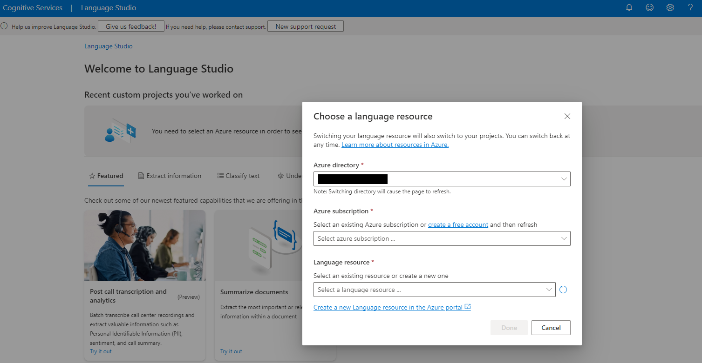
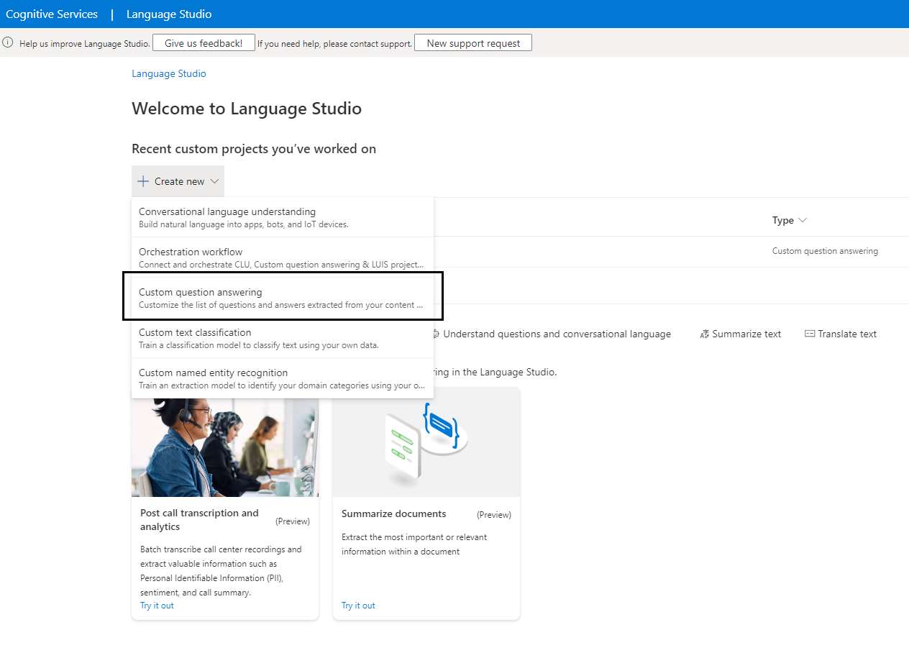
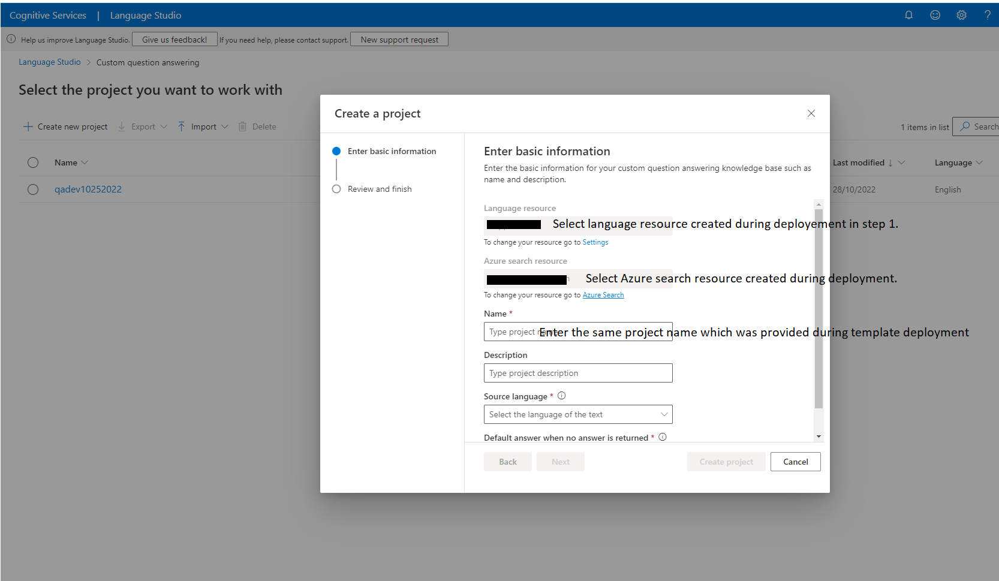

# How to choose the deployment procedure appropriate for your configuration?

> **Note** : This guide is intended for customers requiring the deployment of FAQ Plus of Office 365 Government Community Cloud (aka GCC) only - The standard deployment for Azure AD Commercial tenant is located [here](https://github.com/OfficeDev/microsoft-teams-apps-faqplus/wiki/Deployment-Guide) 

Microsoft provides different cloud offering across Office 365, Azure or the Power Platform to meet customers compliance and regulation requirements. While the global Office 365 and Azure flavors, referred as “Commercial” cloud, are the default and most used environments, customers can choose other alternatives that we’ll refer as Microsoft Cloud for Government.

Microsoft Cloud for Government provides a comprehensive cloud platform designed expressly for U.S. Federal, State, and Local Governments to meet the U.S. Government’s thorough security and compliance regulations. Microsoft Cloud for Government meets the standards of many government agencies, including FedRAMP, HIPAA, and CJIS, to name a few. 

Depending on the cloud offerings that are used, there are differences to consider in terms of service availability and URLs to access and manage those services. Here is a global representation of these different configuration across Office 365, Azure and Power Platform for Commercial and US Gov cloud offerings. 

 [[/Images/GCCHigh1.png|GCCHigh1]]

If you need more information on these offerings for US Sovereign Cloud, please refer to the following article - https://aka.ms/AA632wo 

## Here are the tests to run to identify you current GCC setup :

### Check 1 - Identify your Office 365 configuration.

- From a web browser, go to https://gettenantpartitionweb.azurewebsites.net/ 
- Enter the name of your Azure AD tenant – e.g. contoso.onmicrosoft.com.
- Press “Lookup tenant” and check the results.

|Lookup Results|Mapping|
|-----------|---------|
|Azure AD Instance: Azure AD Global, Tenant Scope: Not applicable |O365 Commercial|
|Azure AD Instance: Azure AD Global, Tenant Scope: GCC (Moderate)|O365 GCC|
|Azure AD Instance: Azure AD Government, Tenant Scope: GCC High|O365 GCC-H|

Save this value as the result for Check 1

### Check 2a - Identify your Azure configuration (for templates based on Azure resources only)

There are only two options here based on the URL used to access the Azure portal and deploy your resources.

|Azure portal URL|Mapping|
|-----------|---------
|https://portal.azure.com|Azure Commercial|
|https://portal.azure.us|Azure Government|

Save this value as the result for Check 2a

More info on Azure services and URL patterns for Commercial vs Gov clouds

[Compare Azure Government and global Azure - Azure Government | Microsoft Docs](https://docs.microsoft.com/en-us/azure/azure-government/compare-azure-government-global-azure)

### Check 2b - Identify your Power Platform configuration (for templates based on Power Platform only)

Here are the URL patterns for Power Platform to determine the cloud environment.

|Power App portal URL|Mapping|
|-----------|---------
|https://*.powerapps.com|Power App Commercial|
|https://*.gov.powerapps.us|Power App GCC|
|https://*.high.powerapps.us|Power App GCC-H|
|Not supported|Power App DoD|

Save this value as the result for Check 2b

More info on Power Platform services and URL patterns for Commercial vs Gov clouds

[Microsoft Power Apps US Government - Power Platform | Microsoft Docs](https://docs.microsoft.com/en-us/power-platform/admin/powerapps-us-government)

### Check 3 - Are you running in multi or single-tenancy mode (for templates based on Azure resources only)? 

This question is to determine if your Azure subscription is linked to the same Azure AD as the one where your Office 365 users are deployed. 

If you use the same domain to access the Azure portal than your O365 services, the answer is **single-tenancy**.
 e.g. you use your O365 credentials to access the Azure portal. 

Otherwise, the answer is **multi-tenancy**. 
e.g. you have different email addresses or use different Azure AD to access O365 and the Azure. 

Based on these different checks, you can determine your configuration and which deployment model to use. 

Save this value as the result for Check 3
 
## Your Microsoft Teams app templates is based on Azure resources.

|Check 1|Check 2a|Check 3|Supported|Deployment scenario|
|-----------|---------|-----------|---------|-----------
|O365 Commercial|Azure Commercial|Single|Yes|Standard|
|O365 Commercial|Azure Commercial|Multi|Yes|Standard (1)|
|O365 GCC|Azure Commercial|Single|Yes|Standard (2)|
|O365 GCC|Azure Commercial|Multi|Yes|Standard (1) (2)|
|O365 GCC|Azure Government|Single|Not Supported|Not Available (3)|
|O365 GCC|Azure Government|Multi|Yes|Hybrid|
|O365 GCC-H/DoD|Any|Any|Not Supported|Not Available (4)|

(1)	Use the standard deployment procedure – Pay attention to the tenantID provided in the input parameters of the ARM template: you should change the default value (the Azure AD linked to your Azure subscription) to the Azure AD tenantID where your O365 users and services are located.

(2)	Use the standard deployment procedure – Microsoft Teams admin portal for GCC now supports “Manage Apps” as well as “App setup policies” – Also, Teams for GCC now supports “Message Extensions” so there is nothing specific to do to deploy on O365 GCC compared to O365 Commercial with Azure Commercial.

(3)	By design, O365 GCC and Azure Gov are connected to different Azure AD tenants – It’s not possible to be in a single tenant configuration with this setup.

(4)	Most the Microsoft App templates rely on the Azure Bot Service to enable bot / Message Extensions in Teams. Microsoft Teams channel is not yet enabled for Azure Bot Service on Azure Government.

Before deploying a Teams app template to your Azure Government subscription, make sure that all the required services and pre-requisites are met. This means that the list of required Azure services are available and registered on the targeted region. This page explains how to verify that a resource provider is available and how to register it for your subscription -

[Resource providers and resource types - Azure Resource Manager | Microsoft Docs](https://docs.microsoft.com/en-us/azure/azure-resource-manager/management/resource-providers-and-types)

## Your Microsoft Teams app templates is based on Power Platform.

|Check 1|Check 2b|Supported|Deployment scenario|
|-----------|---------|-----------|---------
|O365 Commercial|Power Platform Commercial|Yes|Standard
|O365 GCC|Power Platform GCC|Yes|Standard (5) (6)
|O365 GCC-H|Power Platform GCC-H|Yes|Standard (5) (6)
|O365 DoD|Power Platform DoD|Not Supported|Not Available (7)

(5)	Use the standard deployment procedure – Depending on the pre-requisites and services used on the Power Platform, some Teams app template may not be available for O365 GCC/GCC-H. A complete list of O365 and Power Platform services available on Office 365 Gov and service plan is available here -

[Office 365 US Government - Service Descriptions | Microsoft Docs](https://docs.microsoft.com/en-us/office365/servicedescriptions/office-365-platform-service-description/office-365-us-government/office-365-us-government)

(6)	For Teams app templates that require Dataverse for Teams in GCC/GCC-H, you will need an additional stand-alone license for Power Apps. This is a current limit.

(7)	Power Platform is not available on O365 DoD and is therefore out of scope.	
 
# What is “hybrid deployment”?

In this setup, the Office 365 users and Microsoft Teams service are hosted in a different Azure AD tenant as the Azure resources. Also, both O365 and Azure use a Government Cloud:

- Office 365 with a GCC Azure AD tenant 
- Azure Government (https://portal.azure.us) associated to its GCC-H Azure AD tenant

To register a bot as an application in Microsoft Teams, the bot needs to be registered on the Azure Bot Service. This Azure Bot Service also needs to be deployed on an Azure subscription that is linked to the Azure AD tenant where your O365 users and Microsoft Teams service are. This is what we call the hybrid deployment.

Here is a high-level representation for the hybrid deployment.

  [[/Images/GCCHigh2.png|GCCHigh2]]

The hybrid deployment guide considers these multiple Azure subscriptions and Azure AD tenant. It also details the sequence and order of deployment of these resources.

**Note** : Azure Bot Service is only here to register your application as a bot in your Microsoft Teams environment. It is also used to activate SSO when needed, using the same Azure AD tenant where your O365 users are. There is no conversation data or attachments that transit via the Azure Bot Service deployed on Azure Commercial: all communications are in direct transit (https) between your Microsoft Teams service in GCC and the application bot hosted on Azure Government.

# Deployment in O365 GCC tenant and Azure Commercial subscription

For O365 GCC deployment and Azure Commercial, the same [deployment guide](https://github.com/OfficeDev/microsoft-teams-apps-faqplus/wiki/Deployment-Guide) (available on FAQ Plus GitHub repo) can be followed. Use O365 GCC tenant for App registration (Step 1 in deployment guide) and Azure commercial subscription for ARM deployment (Step 2 in deployment guide). Make sure tenant Id of O365 GCC tenant is added during ARM deployment.
 
# Deployment in O365 GCC tenant and Azure Government subscription

For hybrid deployment, follow these deployment guide steps.

## Prerequisites

To begin, you will need: 

- An Azure Governement subscription where you can create the following resources:  
 	- App Service
	- App Service plan
	- Azure storage account
	- Azure Search
	- Azure Function
	* Question answering cognitive service
	- Application Insights  
- An Azure Commercial subscription where you can create the following resources:  
    - Bot Channels Registration	
- A team in Microsoft Teams GCC with your group of experts. (You can add and remove team members later!)
- A reasonable set of Question and Answer pairs to set up the knowledge base for the bot.
- A copy of the FAQ Plus app GitHub repo (https://github.com/OfficeDev/microsoft-teams-apps-faqplus)

# Deployment Steps for hybrid mode

## Step 1: Register Azure AD applications

Register two Azure AD applications in directory where the Team's users are homed (Office 365 GCC + Azure Commercial): one for the bot, and another for the configuration app.

1. Log in to the Azure Portal for your Azure Commerical subscription, and go to the "App registrations" blade [here](https://portal.azure.com/#blade/Microsoft_AAD_IAM/ActiveDirectoryMenuBlade/RegisteredApps).
Verify that you are on the same Azure AD tenant than your O365 users and where Microsoft Teams is deployed.

2. Click on "New registration", and create an Azure AD application.
	1. **Name**: The name of your Teams app - if you are following the template for a default deployment, we recommend "FAQ Plus".
	2. **Supported account types**: Select "Accounts in any organizational directory"
	3. Leave the "Redirect URL" field blank.

3. Click on the "Register" button.

4. When the app is registered, you'll be taken to the app's "Overview" page. Copy the **Application (client) ID** and **Directory (tenant) ID**; we will need it later. Verify that the "Supported account types" is set to **Multiple organizations**.

5. On the side rail in the Manage section, navigate to the "Certificates & secrets" section. In the Client secrets section, click on "+ New client secret". Add a description of the secret and select an expiry time. Click "Add".

6. Once the client secret is created, copy its **Value**; we will need it later.

7. Go back to “App registrations”, then repeat steps 2-3 to create another Azure AD application for the configuration app.
	1. **Name**: The name of your configuration app. We advise appending “Configuration” to the name of this app; for example, “FAQ Plus Configuration”.
	2. **Supported account types**: Select "Account in this organizational directory only"
	3. Leave the "Redirect URL" field blank for now.

At this point you have 4 unique values:

- Application (botclientId) ID for the bot
- Client secret for the bot
- Application (configAppClientId) ID for the configuration app
- Directory (tenant) ID, which is the same for both apps

We recommend that you copy these values into a text file, using an application like Notepad. We will need these values later.

## Step 2: Deploy bot to your Azure Commercial subscription

1. Click on the "Deploy to Azure" button below.

2. When prompted, log in to your **Azure Commercial subscription**.
3. Azure will create a "Custom deployment" based on the ARM template and ask you to fill in the template parameters.
4. Select a subscription and resource group.
	- We recommend creating a new resource group.
	- The resource group location MUST be in a data center that supports Application Insights
5. Enter a "Base Resource Name", which the template uses to generate names for the other resources.
	- The app service names [Base Resource Name], [Base Resource Name]-config, and [Base Resource Name]-questionAnswering must be available. For example, if you select contosofaqplus as the base name, the names contosofaqplus, contosofaqplus-config, and contosofaqplus-questionAnswering must be available (not taken); otherwise, the deployment will fail with a conflict error.
	- Remember the base resource name that you selected. We will need it later.
6. Fill in the various IDs in the template:
    - Bot Client ID: The application (client) ID of the Microsoft Teams Bot app
	     - Make sure that the values are copied as-is, with no extra spaces. The template checks that GUIDs are exactly 36 characters.
7. If you wish to change the app name, description, and icon from the defaults, modify the corresponding template parameters.
8. Click on "Review + create" to start the deployment. It will validate the parameters provided in the template. Once the validation is passed, click on create to start the deployment.
9. Wait for the deployment to finish. You can check the progress of the deployment from the "Notifications" pane of the Azure Portal. It can take more than 10 minutes for the deployment to finish.
10. Once the deployment has finished, you would be directed to a page that has the following fields:
    - botId - This is the Microsoft Application ID for the FAQ Plus bot.
	- appDomain - This is the base domain for the FAQ Plus Bot.

11. Search for Bot Service created by ARM template. Name of Bot Service will be base resource name which was provided earlier.

12. Click on Channels in Settings section of Bot Services and click on "Edit" button for Microsoft Teams Channel. Click on Delete Channel.
13. Once deleted, click on "Configure Microsoft Teams Channel" icon inside "Add a featured Channel". Select "Microsoft Teams for Government" and click on Save.

[[/Images/BotChannelGovernment.PNG|Add channel to bot]]

## Step 3: Deploy remaining resources to your Azure Government subscription
1. Click on the "Deploy to Azure" button below.

 

2. When prompted, log in to your **Azure Government subscription**.
3. Azure will create a "Custom deployment" based on the ARM template and ask you to fill in the template parameters.
4. Select a subscription and resource group.
	- We recommend creating a new resource group.
	- The resource group location MUST be in a data center that supports:
	     - Application Insights
		 - Azure Search
		 - Cognitive Service for Language (Question Answering)
    - For an up-to-date list, click [here](https://azure.microsoft.com/en-us/global-infrastructure/services/?products=logic-apps%2Ccognitive-services%2Csearch%2Cmonitor). , and select a region where the following services are available:
	     - Application Insights
		 - Azure Search
		 - Cognitive Service for Language (Question Answering)
5.  Enter and reuse **the same Base Resource Name**, that you gave for bots deployment in your Azure commercial.
	- The app service names [Base Resource Name], must be available. For example, if you select contosoworkplaceawards as the base name, the names contosoworkplaceawards must be available (not taken); otherwise, the deployment will fail with a Conflict error.
6. Fill in the various IDs in the template:
	- botClientId - The application (client) ID registered in Step 1.
	- botClientSecret - The client secret registered in Step 1.
	- isGCCHigh - True if deployment tenant is GCC government tenant.
	- tenantId - The tenant ID registered in Step 1. If your Microsoft Teams tenant is same as Azure subscription tenant, then we would recommend to keep the default values.
	- botAppInsightsKey - Navigate to App Insights created during Azure commercial deployment. Under left menu, select Properties under Configure. Copy the instrumentation key. 
	- configAppClientId - The application (client) ID of the configuration app
	- configAdminUPNList - a semicolon-delimited list of users who will be allowed to access the configuration app.
		- For example, to allow Megan Bowen (meganb@contoso.com) and Adele Vance (adelev@contoso.com) to access the configuration app, set this parameter to `meganb@contoso.com;adelv@contoso.com`.
        * You can change this list later by going to the configuration app service's "Configuration" blade.
	-  Make sure that the values are copied as-is, with no extra spaces.The template checks that GUIDs are exactly 36 characters. 
7. If you wish to change the Git repo Url from the defaults, modify the corresponding template parameters.
8. Click on "Review + create" to start the deployment. It will validate the parameters provided in the template. Once the validation is passed, click on create to start the deployment.
9. Wait for the deployment to finish. You can check the progress of the deployment from the "Notifications" pane of the Azure Portal. It can take more than 20 minutes for the deployment to finish.

## Step 4: Set up authentication for the configuration app

1. Note the location of the configuration app that you deployed, which is `https://[BaseResourceName]-config.azurewebsites.us`. For example, if you chose "contosofaqplus" as the base name, the configuration app will be at `https://contosofaqplus-config.azurewebsites.us`

2. Go back to the "App Registrations" page [here](https://portal.azure.com/#blade/Microsoft_AAD_IAM/ActiveDirectoryMenuBlade/RegisteredAppsPreview).

3. Click on the configuration app in the application list. Under "Manage", click on "Authentication" to bring up authentication settings.

4. Click on Add a platform, select Web.

5. Add new entry to "Redirect URIs":
	If your configuration app's URL is https://contosofaqplus-config.azurewebsites.us, then add the following entry as the Redirect URIs:
	- https://contosofaqplus-config.azurewebsites.us

	Note: Please refer to Step 4.1 for more details about the URL. 

6. Under "Implicit grant", check "ID tokens" and "Access tokens". The reason to check "ID tokens" is because you are using only the accounts on your current Azure tenant and using that to authenticate yourself in the configuration app. Click configure.

7. Add new entries to "Redirect URIs":
	If your configuration app's URL is https://contosofaqplus-config.azurewebsites.us, then add the following entry as the Redirect URIs:
	- https://contosofaqplus-config.azurewebsites.us/signin
	- https://contosofaqplus-config.azurewebsites.us/configuration

8. Click "Save" to commit your changes.

## Step 5: Create the Question Answering Project

Create a project on the [Question Answering portal](https://language.cognitive.azure.com/questionAnswering/projects), following the instructions in the Question Answering documentation [Question Answering documentation](https://learn.microsoft.com/en-us/azure/cognitive-services/language-service/question-answering/how-to/create-test-deploy).

Select the existing Azure subscription and Choose language resource which created in step 1 "Deploy to your Azure subscription".

Skip the step, "Create a new language resource", because the script that you deployed in Step 1 "Deploy to your Azure subscription" already created the language service. Proceed directly to the next step, by selecting the already create language resource.

Create a new Custom Question Answering project with the same name which was entered in the Step 1.

### Multi-Turn Enablement
With the new updates to the FAQ Plus app template, the knowledge base can now support multi-turn conversations. 

## Step 6: Finish configuring the FAQ Plus app

1. Go to the configuration app, which is at `https://[BaseResourceName]-config.azurewebsites.us`. For example, if you chose “contosofaqplus” as the base name, the configuration app will be at `https://contosofaqplus-config.azurewebsites.us`.

2. You will be prompted to log in with your credentials. Make sure that you log in with an account that is in the list of users allowed to access the configuration app.

3. Get the link to the team with your experts from the Teams client. To do so, open Microsoft Teams, and navigate to the team. Click on the "..." next to the team name, then select "Get link to team".

Click on "Copy" to copy the link to the clipboard.

4. Paste the copied link into the "Team Id" field, then press "OK".

5. Enter the Question Answering Project name into the "Project Name" field, then press "OK".

6. Customize the "Welcome message" that's sent to your End-users when they install the app. This message supports basic markdown, such as bold, italics, bulleted lists, numbered lists, and hyperlinks. See [here](https://docs.microsoft.com/en-us/adaptive-cards/authoring-cards/text-features#markdown) for complete details on what Markdown features are supported.

### Note

Remember to click on "OK" after changing a setting. To edit the setting later, click on "Edit" to make the text box editable.

## Step 7: Create the Teams app packages

Create two Teams app packages: one for end-users to install personally, and one to be installed to the experts' team.

1. Open the `Manifest\manifest_enduser.json` file in a text editor.

2. Change the placeholder fields in the manifest to values appropriate for your organization.

- `developer.name` ([What's this?](https://docs.microsoft.com/en-us/microsoftteams/platform/resources/schema/manifest-schema#developer))
- `developer.websiteUrl`
- `developer.privacyUrl`
- `developer.termsOfUseUrl`

3. Replace all the occurrences of `<<botId>>` placeholder to your Azure AD application's ID from above. This is the same GUID that you entered in the template under "Bot Client ID".

4. In the "validDomains" section, replace all the occurrences of `<<appDomain>>` with your Bot App Service's domain. This will be `[BaseResourceName].azurewebsites.us`. For example, if you chose "contosofaqplus" as the base name, change the placeholder to `contosofaqplus.azurewebsites.us`.

5. Save and Rename `manifest_enduser.json` file to a file named `manifest.json`.

6. Create a ZIP package with the `manifest.json`,`color.png`, and `outline.png`. The two image files are the icons for your app in Teams.
- Name this package `faqplus-enduser.zip`, so you know that this is the app for end-users.
- Make sure that the 3 files are the _top level_ of the ZIP package, with no nested folders.

7. Rename the `manifest.json` file to `manifest_enduser.json` for reusing the file.

8.  Open the `Manifest\manifest_sme.json` file in a text editor.

9. Repeat the steps from 2 to 4 to replace all the placeholders in the file.

10. Save and Rename `manifest_sme.json` file to a file named `manifest.json`.

11. Create a ZIP package with the `manifest.json`,`color.png`, and `outline.png`. The two image files are the icons for your app in Teams.
* Name this package `faqplus-experts.zip`, so you know that this is the app for sme/experts.
* Make sure that the 3 files are the _top level_ of the ZIP package, with no nested folders.

12. Rename the `manifest.json` file to `manifest_sme.json` for reusing the file.

## Step 8: Run the apps in Microsoft Teams

1. If your tenant has sideloading apps enabled, you can install your app by following the instructions [here](https://docs.microsoft.com/en-us/microsoftteams/platform/concepts/apps/apps-upload#load-your-package-into-teams)

2. You can also upload it to your tenant's app catalog so that it can be available for everyone in your tenant to install. See [here](https://docs.microsoft.com/en-us/microsoftteams/tenant-apps-catalog-teams)

3. Install the experts' app (the `faqplus-experts.zip` package) to your team of subject-matter experts. This **MUST** be the same team that you selected in Step 6.3 above.

    **NOTE:** Do NOT use app permission policies to restrict the experts' app to the members of the subject matter experts team. Teams does not support applying different policies to the same bot via two different app packages. If you do this, you may find that the end-user app does not respond to some users.

4. Install the end-user app (the `faqplus-enduser.zip` package) to your users.

## Troubleshooting

Please see our [Troubleshooting](https://github.com/OfficeDev/microsoft-teams-apps-faqplus/wiki/Troubleshooting) page.