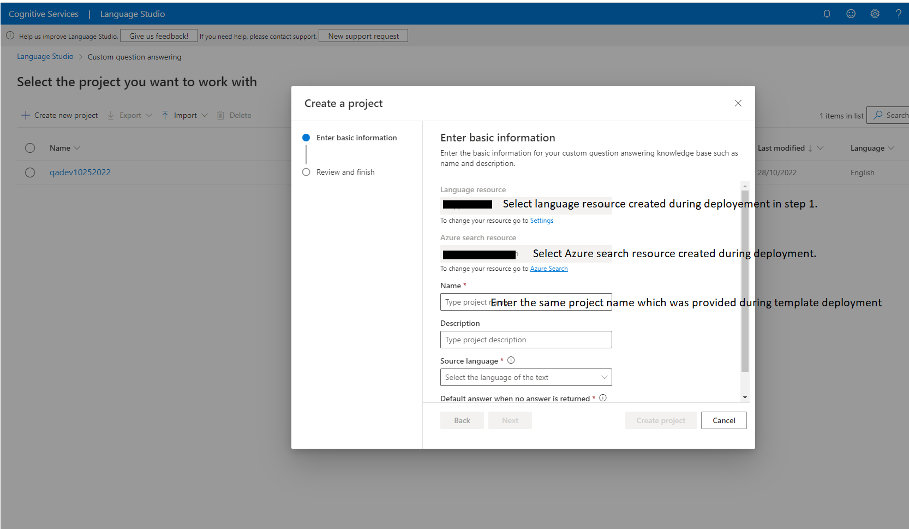
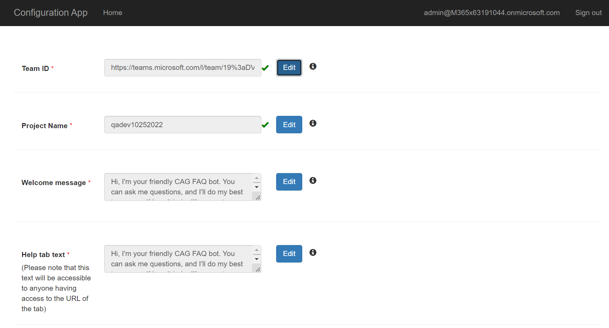

## Prerequisites

To begin, you will need: 

* An Azure subscription where you can create the following kind of resources:
	* App service
	* App service plan
	* Bot channels registration
	* Azure storage account
	* Azure search
	* Azure function
	* Question answering cognitive service
	* Application insights  
* A team in Microsoft Teams with your group of experts. (You can add and remove team members later!)
* A copy of the FAQ Plus app GitHub repo (https://github.com/v-royavinash/microsoft-teams-apps-faqplus)
* A reasonable set of Question and Answer pairs to set up the knowledge base for the bot.

## Step 1: Register Azure AD applications

Register three Azure AD applications in your tenant's directory: one for the end user bot, one for the expert bot, and another for the configuration app.

1. Log in to the Azure Portal for your subscription, and go to the "App registrations" blade [here](https://portal.azure.com/#blade/Microsoft_AAD_IAM/ActiveDirectoryMenuBlade/RegisteredApps).

2. Click on "New registration", and create an Azure AD application.
	1. **Name**: The name of your Expert's app - if you are following the template for a default deployment, we recommend "FAQ Plus Expert".
	2. **Supported account types**: Select "Accounts in any organizational directory".
	3. Leave the "Redirect URL" field blank.

3. Click on the "Register" button.

4. When the app is registered, you'll be taken to the app's "Overview" page. Copy the **Application (client) ID** and **Directory (tenant) ID**; we will need it later. Verify that the "Supported account types" is set to **Multiple organizations**.

5. On the side rail in the Manage section, navigate to the "Certificates & secrets" section. In the Client secrets section, click on "+ New client secret". Add a description of the secret and select an expiry time. Click "Add".

6. Once the client secret is created, copy its **Value**; we will need it later.

7. Go back to “App registrations”, then repeat steps 2-6 to create another Azure AD application for the end user app.
	1. **Name**: The name of your End User app - if you are following the template for a default deployment, we recommend "FAQ Plus User".
	2. **Supported account types**: Select "Accounts in any organizational directory".
	3. Leave the "Redirect URL" field blank for now.

8. Go back to “App registrations”, then repeat steps 2-3 to create another Azure AD application for the configuration app.
	1. **Name**: The name of your configuration app. We advise appending “Configuration” to the name of this app; for example, “FAQ Plus Configuration”.
	2. **Supported account types**: Select "Account in this organizational directory only"
	3. Leave the "Redirect URL" field blank for now.

At this point you have 6 unique values:

* Application (client) ID for the expert bot.
* Client secret for the expert bot.
* Application (client) ID for the end user bot.
* Client secret for the end user bot.
* Application (client) ID for the configuration app.
* Directory (tenant) ID, which is the same for all the apps.

We recommend that you copy these values into a text file, using an application like Notepad. We will need these values later.

## Step 2: Deploy to your Azure subscription

1. Click on the "Deploy to Azure" button below.

2. When prompted, log in to your Azure subscription.

3. Azure will create a "Custom deployment" based on the ARM template and ask you to fill in the template parameters.

4. Select a subscription and resource group.
* We recommend creating a new resource group.
* The resource group location MUST be in a data center that supports:
	* Application Insights
	* Azure Search
	* Cognitive Service for Language (Question Answering)
* For an up-to-date list, click [here](https://azure.microsoft.com/en-us/global-infrastructure/services/?products=logic-apps,cognitive-services,search,monitor), and select a region where the following services are available:
	* Application Insights
	* Cognitive Service for Language (Question Answering)
	* Azure Search

5. Enter a "Base Resource Name", which the template uses to generate names for the other resources.
* The app service names `[Base Resource Name]`, `[Base Resource Name]-config`, and `[Base Resource Name]-questionAnswering` must be available. For example, if you select `contosofaqplus` as the base name, the names `contosofaqplus`, `contosofaqplus-config`, and `contosofaqplus-questionAnswering` must be available (not taken); otherwise, the deployment will fail with a conflict error.
* Remember the base resource name that you selected. We will need it later.

6. Fill in the various IDs in the template:

	1. **Expert Bot Client ID**: The application (client) ID of the Expert Bot app

	2. **Expert Bot Client Secret**: The client secret of the Expert Bot app

	3. **User Bot Client ID**: The application (client) ID of the User Bot app

	4. **User Bot Client Secret**: The client secret of the User Bot app

	5. **Config App Client Id**: The application (client) ID of the configuration app

	6. **Tenant Id**: The tenant ID registered in Step 1. If your Microsoft Teams tenant is the same as Azure subscription tenant, then we would recommend keeping the default values.

Make sure that the values are copied as-is, with no extra spaces. The template checks that GUIDs are exactly 36 characters.

7. Fill in the "Config Admin UPN List", which is a semicolon-delimited list of users who will be allowed to access the configuration app.
* For example, to allow Megan Bowen (meganb@contoso.com) and Adele Vance (adelev@contoso.com) to access the configuration app, set this parameter to `meganb@contoso.com;adelv@contoso.com`.
* You can change this list later by going to the configuration app service's "Configuration" blade.

8. If you wish to change the app name, description, and icon from the defaults, modify the corresponding template parameters.

9. Agree to the Azure terms and conditions by clicking on the checkbox "I agree to the terms and conditions stated above" located at the bottom of the page.

10. Click on "Purchase" to start the deployment.

11. Wait for the deployment to finish. You can check the progress of the deployment from the "Notifications" pane of the Azure Portal. It can take more than 10 minutes for the deployment to finish.

12. Once the deployment has finished, you would be directed to a page that has the following fields:
* expertBotId - This is the Expert bot ID for the FAQ Plus Expert bot.
* userBotId - This is the User bot ID for the FAQ Plus User bot.
* appDomain - This is the base domain for the FAQ Plus Bot.
* configurationAppUrl - This is the URL for the configuration web application.

## Step 3: Set up authentication for the configuration app

1. Note the location of the configuration app that you deployed, which is `https://[BaseResourceName]-config.azurewebsites.net`. For example, if you chose "contosofaqplus" as the base name, the configuration app will be at `https://contosofaqplus-config.azurewebsites.net`

2. Go back to the "App Registrations" page [here](https://portal.azure.com/#blade/Microsoft_AAD_IAM/ActiveDirectoryMenuBlade/RegisteredAppsPreview).

3. Click on the configuration app in the application list. Under "Manage", click on "Authentication" to bring up authentication settings.

4. Click on Add a platform, select Web.

5. Add new entry to "Redirect URIs":
	If your configuration app's URL is https://contosofaqplus-config.azurewebsites.net, then add the following entry as the Redirect URIs:
	- https://contosofaqplus-config.azurewebsites.net

	Note: Please refer to Step 3.1 for more details about the URL. 

6. Under "Implicit grant", check "ID tokens" and "Access tokens". The reason to check "ID tokens" is because you are using only the accounts on your current Azure tenant and using that to authenticate yourself in the configuration app. Click configure.

7. Add new entries to "Redirect URIs":
	If your configuration app's URL is https://contosofaqplus-config.azurewebsites.net, then add the following entry as the Redirect URIs:
	- https://contosofaqplus-config.azurewebsites.net/signin
	- https://contosofaqplus-config.azurewebsites.net/configuration

8. Click "Save" to commit your changes.

## Step 4: Create the Question Answering Project

Create a project on the [Question Answering portal](https://language.cognitive.azure.com/questionAnswering/projects), following the instructions in the [Question Answering documentation](https://learn.microsoft.com/en-us/azure/cognitive-services/language-service/question-answering/how-to/create-test-deploy).

Select the existing Azure subscription and Choose language resource which created in step 2 "Deploy to your Azure subscription".

Skip the step, "Create a new language resource", because the script that you deployed in Step 2 "Deploy to your Azure subscription" already created the language service. Proceed directly to the next step, by selecting the already create language resource.

Create a new Custom Question Answering project with the same name which was entered in the Step 2.

### Multi-Turn Enablement
With the new updates to the FAQ Plus app template, the knowledge base can now support multi-turn conversations. 

## Step 5: Finish configuring the FAQ Plus app

1. Go to the configuration app, which is at `https://[BaseResourceName]-config.azurewebsites.net`. For example, if you chose “contosofaqplus” as the base name, the configuration app will be at `https://contosofaqplus-config.azurewebsites.net`.

2. You will be prompted to log in with your credentials. Make sure that you log in with an account that is in the list of users allowed to access the configuration app.

3. Get the link to the team with your experts from the Teams client. To do so, open Microsoft Teams, and navigate to the team. Click on the "..." next to the team name, then select "Get link to team".

Click on "Copy" to copy the link to the clipboard.

4. Paste the copied link into the "Team Id" field, then press "OK".

5. Enter the Question Answering Project name into the "Project Name" field, then press "OK".

6. Customize the "Welcome message" that's sent to your End-users when they install the app. This message supports basic markdown, such as bold, italics, bulleted lists, numbered lists, and hyperlinks. See [here](https://docs.microsoft.com/en-us/adaptive-cards/authoring-cards/text-features#markdown) for complete details on what Markdown features are supported.

### Notes

Remember to click on "OK" after changing a setting. To edit the setting later, click on "Edit" to make the text box editable.

## Step 6: Create the Teams app packages

Create two Teams app packages: one for end-users to install personally, and one to be installed to the experts' team.

1. Open the `Manifest\EndUser\manifest_enduser.json` file in a text editor.

2. Change the placeholder fields in the manifest to values appropriate for your organization.

* `developer.name` ([What's this?](https://docs.microsoft.com/en-us/microsoftteams/platform/resources/schema/manifest-schema#developer))

* `developer.websiteUrl`

* `developer.privacyUrl`

* `developer.termsOfUseUrl`

3. Replace all the occurrences of `<<userBotId>>` placeholder to your Azure AD end user application's ID from above. This is the same GUID that you entered in the template under "User Bot Client ID".

4. In the "validDomains" section, replace all the occurrences of `<<appDomain>>` with your Bot App Service's domain. This will be `[BaseResourceName].azurewebsites.net`. For example, if you chose "contosofaqplus" as the base name, change the placeholder to `contosofaqplus.azurewebsites.net`.

5. Save and Rename `manifest_enduser.json` file to a file named `manifest.json`.

6. Create a ZIP package with the all the files in `Manifest\EndUser` folder - `manifest.json`,`color.png` and `outline.png`, along with localization files - `ar.json`, `de.json`, `en.json`, `es.json`, `fr.json`, `he.json`, `ja.json`, `ko.json`, `pt-BR.json`, `ru.json`, `zh-CN.json`, `zh-TW.json`. The two image files are the icons for your app in Teams.
* Name this package `faqplus-enduser.zip`, so you know that this is the app for end-users.
* Make sure that the 15 files are the _top level_ of the ZIP package, with no nested folders.

7. Rename the `manifest.json` file to `manifest_enduser.json` for reusing the file.

8.  Open the `Manifest\SME\manifest_sme.json` file in a text editor.

9. Repeat the steps from 2 to 4 to replace all the placeholders in the file. The placeholder `<<expertBotId>>` should be replaced by your Azure AD expert application's ID from above.

10. Save and Rename `manifest_sme.json` file to a file named `manifest.json`.

11. Create a ZIP package with the all the files in `Manifest\SME` folder (except manifest_legacy) - `manifest.json`,`color.png` and `outline.png`, along with localization files - `ar.json`, `de.json`, `en.json`, `es.json`, `fr.json`, `he.json`, `ja.json`, `ko.json`, `pt-BR.json`, `ru.json`, `zh-CN.json`, `zh-TW.json`. The two image files are the icons for your app in Teams.
* Name this package `faqplus-sme.zip`, so you know that this is the app for sme.
* Make sure that the 15 files are the _top level_ of the ZIP package, with no nested folders.

12. Rename the `manifest.json` file to `manifest_sme.json` for reusing the file.

## Step 7: Run the apps in Microsoft Teams

1. If your tenant has sideloading apps enabled, you can install your app by following the instructions [here](https://docs.microsoft.com/en-us/microsoftteams/platform/concepts/apps/apps-upload#load-your-package-into-teams)

2. You can also upload it to your tenant's app catalog so that it can be available for everyone in your tenant to install. See [here](https://docs.microsoft.com/en-us/microsoftteams/tenant-apps-catalog-teams)

3. Install the experts' app (the `faqplus-sme.zip` package) to your team of subject-matter experts. This **MUST** be the same team that you selected in Step 5.3 above.

* We recommend using [app permission policies](https://docs.microsoft.com/en-us/microsoftteams/teams-app-permission-policies) to restrict access to this app to the members of the experts' team.

4. Install the end-user app (the `faqplus-enduser.zip` package) to your users.

## Troubleshooting

Please see our [Troubleshooting](https://github.com/v-royavinash/microsoft-teams-apps-faqplus/wiki/Troubleshooting) page.