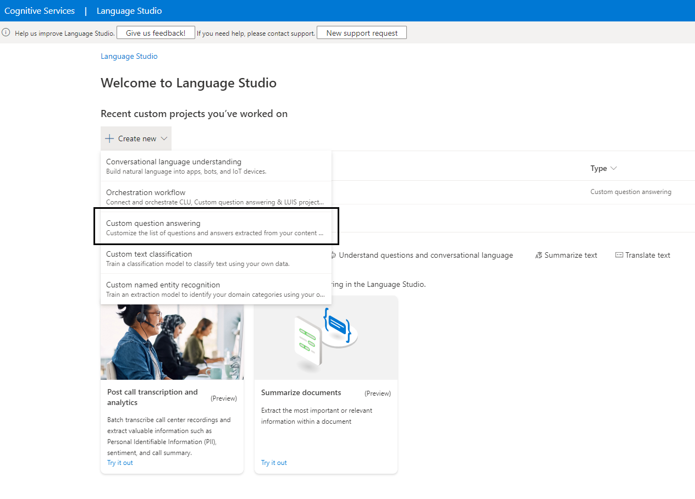

## Prerequisites

To begin, you will need: 

* An Azure subscription where you can create the following kind of resources:
	* App service
	* App service plan
	* Bot channels registration
	* Azure storage account
	* Azure search
	* Azure function
	* Question answering cognitive service
	* Application insights  
* A team in Microsoft Teams with your group of experts. (You can add and remove team members later!)
* A copy of the FAQ Plus app GitHub repo (https://github.com/OfficeDev/microsoft-teams-apps-faqplus)
* A reasonable set of Question and Answer pairs to set up the knowledge base for the bot.
* A user on the Azure subscription with a contributor role or higher.

## Step 1: Deploy to your Azure subscription

** For manual deployment (old approach) please use this [deployment guide](/Wiki/Deployment-Guide-manual.md).

Please follow below steps to deploy app template:

* Download the whole solution folder from [GitHub](https://github.com/OfficeDev/microsoft-teams-apps-faqplus)

	

* Open the PowerShell in **administrator** mode
* Navigate to [deploy.ps1](https://github.com/OfficeDev/microsoft-teams-apps-faqplus/blob/master/Deployment/deploy.ps1) in your local machine.
	* cd `<`PathToLocalFolder`>`\Deployment
* Before running the script, some installations are needed for the user who is running the script for the first time. Please find the steps below: 
   - In the above-navigated path in PowerShell, run the command "**Set-ExecutionPolicy -ExecutionPolicy RemoteSigned**". This command will allow the user to run deploy.ps1 as execution policy is restricted by default. You can change it to restricted again after successful deployment. 
   - You will need to unblock the deployment script file before executing the script "**Unblock-File -Path .\deploy.ps1**"
   - Install Azure CLI module by running the command below:
   "**Invoke-WebRequest -Uri https://aka.ms/installazurecliwindows -OutFile .\AzureCLI.msi; Start-Process msiexec.exe -Wait -ArgumentList '/I AzureCLI.msi /quiet'**" 
   - Reboot the machine after installing the CLI module.
   - Open a new PowerShell window and in administrator mode. Go to the path of deploy.ps1 script file again. 

* Fill-in the Deployment\Parameters.json file with required parameters values for the script. Replace `<<`value`>>` with the correct value for each parameter.

The script requires the following parameters:

* TenantId - Id of the tenant where this app would be used (If you are not sure how to get Tenant ID, please check Azure Active Directory in Azure Portal. Under Manage, click Properties. The tenant ID is shown in the Directory ID box). e.g 98f3ece2-3a5a-428b-aa4f-4c41b3f6eef0

* SubscriptionId - Azure subscription to deploy the solution to (MUST be associated with the Azure AD of the Office 365 tenant that you wish to deploy this solution to.) e.g. 22f602c4-1b8f-46df-8b73-45d7bdfbf58e

* SubscriptionTenantId - Id of the tenant where all the resources would be deployed. It is the tenant Id of above subscription.

* Location - Azure region in which to create the resources. The internal name should be used e.g. uksouth. The location MUST be in a data center that supports:
	* Application Insights
	* Azure Search
	* Cognitive Service for Language (Question Answering)
	* For an up-to-date list, click [Valid Azure Locations](https://azure.microsoft.com/en-us/global-infrastructure/services/?products=logic-apps,cognitive-services,search,monitor), and select a region where the above services are available.

* ResourceGroupName - Name for a new resource group to deploy the solution to - the script will create this resource group. e.g. FAQPlusResourceGroup.

* BaseAppName - Name for the Azure AD app that will be created e.g. FAQPlus.

* BaseResourceName - Name which the template uses to generate names for the other resources.
	* The app service names `[Base Resource Name]`, `[Base Resource Name]-config`, and `[Base Resource Name]-questionAnswering` must be available. For example, if you select `contosofaqplus` as the base name, the names `contosofaqplus`, `contosofaqplus-config`, and `contosofaqplus-questionAnswering` must be available (not taken in other resource groups/tenants); otherwise, the deployment will fail with a conflict error.
	* Remember the base resource name that you selected. We will need it later.

* ConfigAdminUPNList - A semicolon-delimited list of users who will be allowed to access the configuration app. e.g. adminuser@contoso.onmicrosoft.com;user2@contoso.onmicrosoft.com

* CompanyName - Your company name which will added to the app metadata.

* WebsiteUrl - The https:// URL to the company's website. This link should take users to your company or product-specific landing page. Url must start with **https** prefix.

* PrivacyUrl - The https:// URL to the developer's privacy policy. Url must start with **https** prefix.

* TermsOfUseUrl - The https:// URL to the developer's terms of use. Url must start with **https** prefix.

The script has some optional parameters with default values. You can change the default values to fit your needs:

* AppDisplayName - The app (and bot) display name. Default value: FAQ Plus.
* AppDescription - The app (and bot) description. Default value: A friendly FAQ bot that answers questions and connects you to experts.
* AppIconUrl - The link to the icon for the app. It must resolve to a PNG file. Default value https://raw.githubusercontent.com/OfficeDev/microsoft-teams-apps-faqplus/master/Manifest/color.png
* Sku - The pricing tier for the hosting plan. Default value: Standard
* PlanSize - The size of the hosting plan (small, medium, or large). Default value: 2
* QuestionAnsweringSku - The pricing tier for the Question Answering service. Default value: S
* SearchServiceSku - The pricing tier for the Azure Search service. Default value: B (15 indexes)
* GitRepoUrl - The URL to the GitHub repository to deploy. Default value: https://github.com/OfficeDev/microsoft-teams-apps-faqplus.git
* GitBranch - The branch of the GitHub repository to deploy. Default value: master
* IsMigration - True if the app template is being migrated from older version (< 4.0.0). False by default.
* DefaultCulture - Default Culture. "en" is default.

* Execute the following script in Powershell window:

`>.\deploy.ps1`

*The script will prompt for login thrice during execution, once to get access to the Azure subscription, the other to get access to AAD where app template would be used, and the last one to get access to Azure subscription again. Please login using an account that has **contributor** role or higher. If the tenantId and subscriptionTenantId are same, the script wouls prompt for login only once.*

*The script will prompt for login with Azure subscription. Login using account that has Azure subscription.*

*Then the script will validate the existence of Azure resources in the selected region and whether the resources names are available or not. If resources with same name already exist, the script will show a confirmation box to proceed with updating existing resources.*

*If Azure AD applications already exist on tenant, The script will show confirmation dialog to update current applications' configurations.*

*The script will prompt for login using account where the app template would be used. It creates three AAD apps - Expert, User, and Configuration. Once these apps are created, it logs out of this account. If the tenantId and subscriptionTenantId are same, it would create all without this login.*

*The script will again prompt for login with Azure subscription. Login using account that has Azure subscription. If the tenantId and subscriptionTenantId are same, it would skip this login*

When the script has completed a "DEPLOYMENT SUCCEEDED" message will be displayed.

* After running the script. AD apps, Expert/User/Config Apps, and all required resources will be created.

* If PowerShell script breaks during deployment, you may run the deployment again if there is no conflict (a resource name already exist in other resource group or another tenant) or refer to [Troubleshooting](/Wiki/Troubleshooting.md) page.

* If PowerShell script keeps failing, you may share deployment logs (generated in Deployment\\logs.zip) with the app template support team.

## Step 2: Create the Question Answering Project

Create a project on the [Question Answering portal](https://language.cognitive.azure.com/questionAnswering/projects), following the instructions in the Question Answering documentation [Question Answering documentation](https://learn.microsoft.com/en-us/azure/cognitive-services/language-service/question-answering/how-to/create-test-deploy).

Select the existing Azure subscription and Choose language resource which created in step 1 "Deploy to your Azure subscription".

Skip the step, "Create a new language resource", because the script that you deployed in Step 1 "Deploy to your Azure subscription" already created the language service. Proceed directly to the next step, by selecting the already create language resource.

Create a new Custom Question Answering project with the same name which was entered in the Step 1.

 
### Multi-Turn Enablement
With the new updates to the FAQ Plus app template, the knowledge base can now support multi-turn conversations. 

## Step 3: Finish configuring the FAQ Plus app

1. Go to the configuration app, which is at `https://[BaseResourceName]-config.azurewebsites.net`. For example, if you chose “contosofaqplus” as the base name, the configuration app will be at `https://contosofaqplus-config.azurewebsites.net`.

2. You will be prompted to log in with your credentials. Make sure that you log in with an account that is in the list of users allowed to access the configuration app.

3. Get the link to the team with your experts from the Teams client. To do so, open Microsoft Teams, and navigate to the team. Click on the "..." next to the team name, then select "Get link to team".

Click on "Copy" to copy the link to the clipboard.

4. Paste the copied link into the "Team Id" field, then press "OK".

5. Enter the Question Answering Project name into the "Project Name" field, then press "OK".

6. Customize the "Welcome message" that is sent to your End-users when they install the app. This message supports basic markdown, such as bold, italics, bulleted lists, numbered lists, and hyperlinks. See [here](https://docs.microsoft.com/en-us/adaptive-cards/authoring-cards/text-features#markdown) for complete details on what Markdown features are supported.

### Notes

Remember to click on "OK" after changing a setting. To edit the setting later, click on "Edit" to make the text box editable.

## Step 4: Run the apps in Microsoft Teams

In step #1, The powershell script created two Teams app packages: one for end-users to install personally, and one to be installed to the experts' team.

1. Open the `Manifest` folder in file explorer.

2. There should be 2 ZIP packages with the names `faqplus-enduser.zip`, `faqplus-sme.zip`

3. If your tenant has sideloading apps enabled, you can install your app by following the instructions [here](https://docs.microsoft.com/en-us/microsoftteams/platform/concepts/apps/apps-upload#load-your-package-into-teams)

4. You can also upload it to your tenant's app catalog so that it can be available for everyone in your tenant to install. See [here](https://docs.microsoft.com/en-us/microsoftteams/tenant-apps-catalog-teams)

5. Install the experts' app (the `faqplus-experts.zip` package) to your team of subject-matter experts. This **MUST** be the same team that you selected in Step 3.3 above.

* We recommend using [app permission policies](https://docs.microsoft.com/en-us/microsoftteams/teams-app-permission-policies) to restrict access to this app to the members of the experts' team.

6. Install the end-user app (the `faqplus-enduser.zip` package) to your users.

## Troubleshooting

Please see our [Troubleshooting](/Wiki/Troubleshooting.md) page.