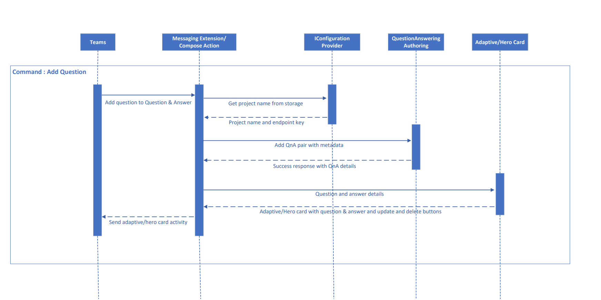
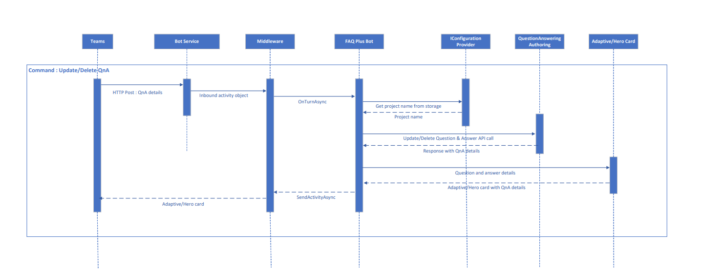
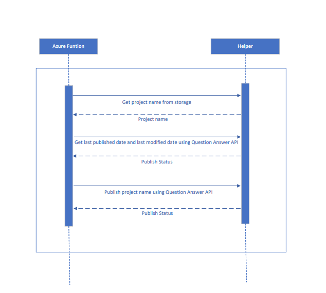

# Data flow diagram to detail out the data flow between various services in  FAQ Plus bot

## Add question using compose action

- User clicks on '+' icon on messaging extension, task module is invoked.

- On click of 'Save' button, bot checks for knowledge base associated with user's team from Azure storage.

- With project name, question is added in Question Answering and corresponding result is shown in card.

## Update/Delete question

- User updates and deleted QnA pair using Update and Delete buttons on adaptive/hero card.

- On clicking buttons, bot checks for project name associated with user's team from Azure storage.

- With project name, question is updated/deleted in Question Answering and corresponding result is shown in card.

  
## Azure function for publishing Question Answering project knowledge base

- Azure function is triggered every fifteen minutes to publish Question Answering project knowledge base.

- It publishes knowledge base only if modification is done from last publish time.

