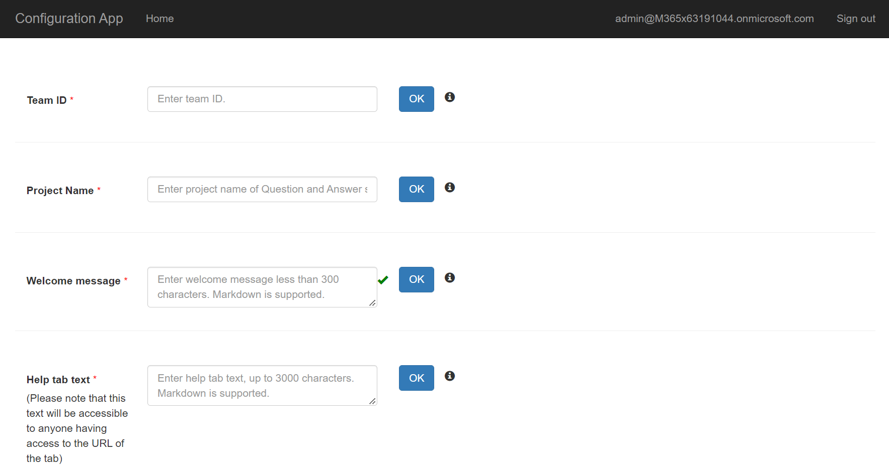
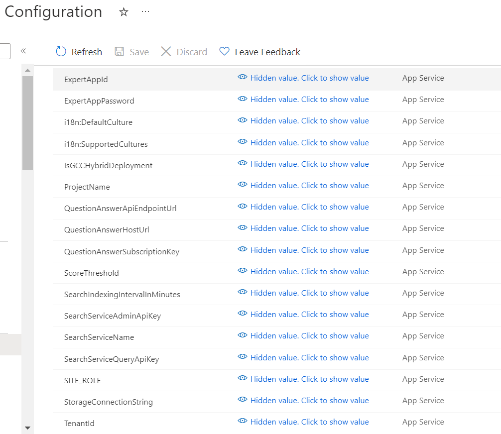

## Scenario 1:

Customize the app to have a different name depending on the team it is installed in. 

For ex: IT aka Contoso IT Support.
 

**Suggested Solution:** Please follow below mentioned steps to configure the app to be used for different domains:

**Code Changes:**

- Change the text references in the associated resource(Strings.resx) file from FAQ Plus to the domain on which it should cater to.

- Update the app name, description, tab name and other details in the associated manifest JSON files for end-user and experts team respectively.

- Change the welcome message as desired in the configurator web app.

  
**Pros:** Very minimal changes required.

## Scenario 2:

Configure the bot to use an existing knowledge base with QnA pairs instead of a raw vanilla Question Answering knowledge base.

**Suggested Solution:**

1) Change the **Project Name** field value in the configurator app and your bot will start pointing to knowledge base with QnA pairs associated with updated Question Answering project knowledge base.

2) Navigate to [Azure portal](https://portal.azure.com/) and go to configuration section of your bot app service, update the appsettings values for ProjectName,QuestionAnswerHostUrl, QuestionAnswerApiEndpointKey & QuestionAnswerApiEndpointUrl of your existing knowledge base.

## Scenario 3:

Expert wants to edit or delete the existing QnA pairs directly added from the Question Answering portal.
 
**Suggested Solution:** 

If expert wants to edit or delete the QnA pairs, the expert needs to navigate to that particular knowledge base in the [Question Answering portal](https://language.cognitive.azure.com/) and can perform the required operations. 